# GitHub Pages 快速开始 🚀

## 🎯 一键部署（最简单）

### 步骤 1：启用 GitHub Pages

1. 打开你的 GitHub 仓库页面
2. 点击 **Settings** → **Pages**
3. 在 **Source** 下拉菜单中选择 **GitHub Actions**


### 步骤 2：推送代码

```bash
git add .
git commit -m "feat: 添加 GitHub Pages 部署"
git push origin main
```

### 步骤 3：等待部署完成

- 前往 **Actions** 标签页
- 观察 `Deploy to GitHub Pages` 工作流
- 等待绿色勾勾 ✅（约 2-5 分钟）

### 步骤 4：访问网站

```
https://<你的 GitHub 用户名>.github.io/<仓库名>/
```

**就这么简单！** 🎉

---

## 📁 已添加的文件

本次配置添加了以下文件：

```
.github/
  └── workflows/
      └── deploy.yml          # GitHub Actions 自动部署工作流

public/
  ├── .nojekyll              # 禁用 Jekyll 处理
  └── 404.html               # SPA 路由支持

package.json                 # 添加了 deploy 脚本和 gh-pages 依赖

DEPLOY.md                    # 详细部署文档
GITHUB_PAGES_QUICKSTART.md   # 本文件（快速开始）
```

---

## 🔧 工作原理

### 自动部署流程

```mermaid
graph LR
    A[推送到 main] --> B[触发 GitHub Actions]
    B --> C[安装依赖]
    C --> D[构建项目]
    D --> E[上传到 GitHub Pages]
    E --> F[网站上线 🎉]
```



### 关键配置

1. **`.github/workflows/deploy.yml`**
   - 自动检测推送到 `main` 分支
   - 使用 pnpm 安装依赖
   - 执行 `pnpm build` 构建项目
   - 设置 `BASE_PATH` 为仓库路径
   - 自动部署到 GitHub Pages

2. **`public/404.html`**
   - 处理单页应用路由
   - 当用户直接访问子路由时，重定向到正确页面
   - 避免 404 错误

3. **`public/.nojekyll`**
   - 告诉 GitHub Pages 不使用 Jekyll
   - 确保所有文件（包括 `_` 开头的）都能正常访问

4. **`vite.config.ts` 中的 `base`**
   - 已配置为 `process.env.BASE_PATH || '/'`
   - 确保资源路径正确

---

## 🎨 手动部署（备选方案）

如果你想手动控制部署：

```bash
# 1. 安装依赖（首次）
pnpm install

# 2. 设置仓库名（替换 <your-repo-name>）
$env:BASE_PATH="/<your-repo-name>/"  # Windows PowerShell
export BASE_PATH="/<your-repo-name>/" # Mac/Linux

# 3. 构建
pnpm build

# 4. 部署
pnpm deploy
```

然后在 GitHub 设置中选择从 `gh-pages` 分支部署。

---

## ❓ 常见问题

### Q: 页面空白或样式丢失？

**A:** 检查 `BASE_PATH` 是否正确设置为 `/<仓库名>/`

### Q: 刷新页面后 404？

**A:** `public/404.html` 已配置好，如仍有问题，清除浏览器缓存

### Q: Actions 权限错误？

**A:** 前往 **Settings** → **Actions** → **General**
- 选择 `Read and write permissions`
- 勾选 `Allow GitHub Actions to create and approve pull requests`

### Q: 部署到自定义域名？

**A:** 在仓库 **Settings** → **Pages** → **Custom domain** 中设置

---

## 🌟 下一步

部署成功后，你可以：

- ✅ 分享你的网站链接
- ✅ 在 README 中添加在线演示徽章
- ✅ 配置自定义域名
- ✅ 设置分析工具（如 Google Analytics）

---

## 📚 更多信息

- 详细部署文档：[DEPLOY.md](./DEPLOY.md)
- 遇到问题？查看 [GitHub Discussions](https://github.com/yourusername/yourrepo/discussions)

---

**祝部署顺利！** 🚀✨

